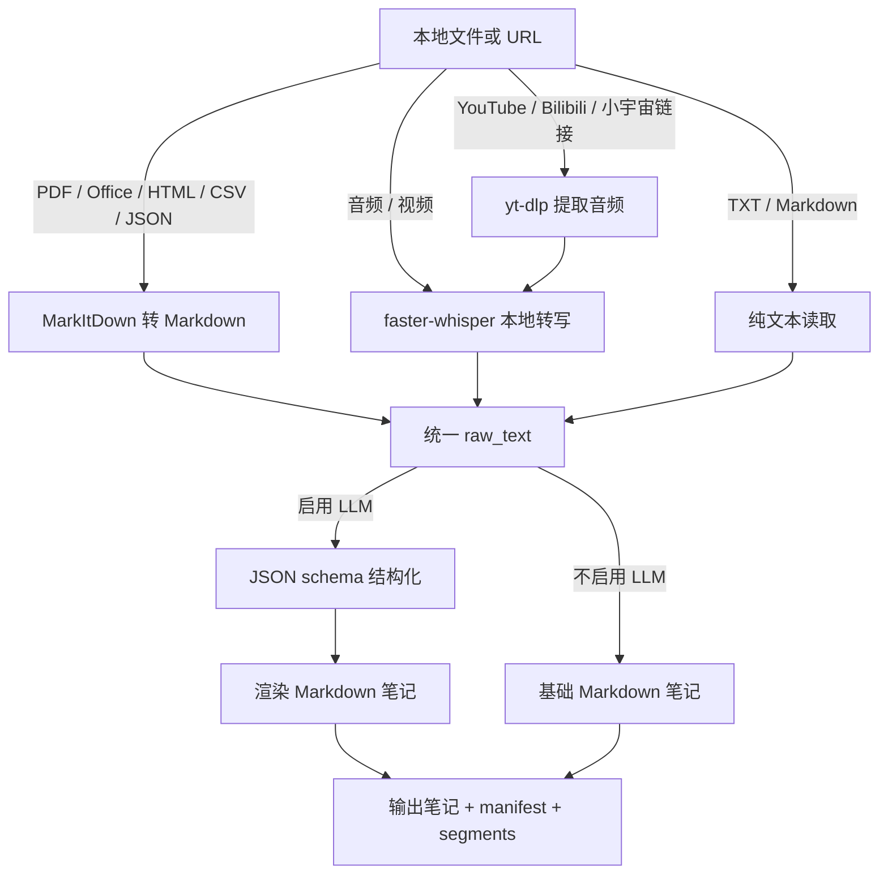

# infra-ingest

本地优先的 AI 资料摄入流水线：把本地文件、音视频和链接转换成可追溯的 Markdown 研究笔记。

`infra-ingest` 是一个小型 Python 工程，用来把非结构化资料整理成可复用的 Markdown 笔记。它可以读取本地文档、用本地 Whisper 转写音视频、通过 `yt-dlp` 处理支持的 URL，并可选调用兼容 OpenAI Chat Completions 协议的大模型，把内容整理成结构化、可追溯的 Obsidian 笔记。

这个项目的重点不是“调用一次模型”，而是展示一条完整的资料处理链路：输入识别、下载、解析、转写、结构化、追踪清单、评测和本地输出。

## 功能概览



## 主要特性

- 支持常见文档转 Markdown：`.pdf`、`.docx`、`.pptx`、`.xlsx`、`.csv`、`.json`、`.xml`、`.html`、`.epub`、`.zip` 等。
- 支持本地音视频转写：`.mp3`、`.wav`、`.m4a`、`.mp4`、`.mov`、`.flac`、`.ogg`、`.webm` 等。
- 支持 YouTube、Bilibili、小宇宙等链接输入，底层通过 `yt-dlp` 或备用解析逻辑提取音频。
- 不配置 LLM API key 时，也可以生成基础 Markdown 笔记。
- 配置 LLM 后，会要求模型输出 JSON schema，再由本地代码渲染成 Markdown，减少格式漂移。
- 结论会要求附带来源片段、时间戳、页码或标题线索，增强可追溯性。
- Whisper 转写会保留 segment 结构，音视频任务会生成 `.segments.json`。
- 每次处理都会生成 `.manifest.json`，记录输入、输出、hash、模型、prompt 版本和处理时间。
- 支持专有名词词表和不同资料类型 prompt。
- 内置小型评测集，可对比不同模型和 prompt 的结构化输出质量。
- 生成后的笔记会写入本地 SQLite 研究库索引，支持全文搜索、metadata 过滤和基于资料片段的 RAG 问答。
- 增加量化金融增强层：抽取公司、ticker、行业、指标、因子和风险事件，并生成投资假设、待验证问题和回测想法模板。
- 保留本地状态：原始资料归档到 `.infra_ingest/raw/`，检索库和图谱保存在 `.infra_ingest/`，便于复盘和迁移。
- 支持 LLM fallback：主模型失败时可自动切换到备用 OpenAI-compatible 服务。

## 项目结构

```text
infra-ingest/
  main.py                 # 兼容入口：python3 main.py
  run                     # 推荐统一入口：./run gui / ./run ingest / ./run test
  run.command             # macOS 双击打开 GUI
  pyproject.toml          # Python 项目元数据和依赖声明
  src/
    infra_ingest/
      cli.py              # 命令行参数解析
      config.py           # 环境变量和 Obsidian vault 配置
      pipeline.py         # 核心处理流水线
      converters.py       # 本地文件类型适配
      document_parser.py  # 文档和 PDF 文本提取
      transcriber.py      # faster-whisper 本地转写
      transcript.py       # 转写 segment 辅助逻辑
      sources.py          # URL 音频提取
      llm_client.py       # OpenAI-compatible API 客户端
      prompts.py          # 不同资料类型的 prompt
      structured_note.py  # JSON schema 解析和 Markdown 渲染
      glossary.py         # 专有名词词表
      finance.py          # 金融实体抽取、数据源摘要和回测模板
      quant_data.py       # 本地行情 CSV 解析和标准化
      backtest.py         # 文本观点事件研究 / 前瞻收益小回测
      research_runs.py    # 研究运行审计记录
      entities.py         # 实体识别和 Obsidian 双链渲染
      library.py          # SQLite FTS 研究库索引和检索
      graph.py            # 本地知识图谱 graph.json 生成
      raw_archive.py      # 原始资料归档
      material_parser.py  # 研报/公告/电话会粗粒度章节解析
      rag.py              # 基于研究库片段的问答
      note_writer.py      # Markdown 笔记生成和写入
      manifest.py         # 处理清单生成
  app/
    whisper_gui.py        # 可选 macOS Tk 图形界面
    launcher.sh           # macOS app 启动脚本
  scripts/
    run_example.sh        # 本地 smoke test
    run_eval.py           # 小型 prompt/model 评测脚本
    test.sh               # pytest 测试入口
    doctor.sh             # 本地依赖诊断
    sync_app.sh           # 同步到 /Applications/Whisper转写.app
  examples/
    input.txt
    sample_report.html
    output.md
  evals/
    mini_eval.jsonl
  tests/
    test_*.py
```

## 安装

创建虚拟环境并安装依赖：

```bash
git clone https://github.com/<your-name>/infra-ingest.git
cd infra-ingest

python3 -m venv .venv
source .venv/bin/activate
pip install -r requirements.txt
```

也可以使用 editable install：

```bash
pip install -e .
```

开发和测试依赖：

```bash
pip install -e ".[dev]"
./scripts/test.sh
```

可选桌面包装器依赖：

```bash
pip install -e ".[app]"
```

音视频处理还需要系统工具：

```bash
brew install ffmpeg yt-dlp
```

`ffmpeg` 用于音视频解码和转码；`yt-dlp` 用于处理 URL 输入。

## 配置

复制环境变量模板：

```bash
cp .env.example .env
```

如果要用本地私有模型，可以参考：

```bash
cp .env.local.example .env.local
./run ingest -i examples/input.txt --env .env.local
```

模型切换、远程 API、本地模型、隐私边界和 Agent 接入说明见：

```text
docs/MODELS_AND_AGENTS.md
```

最小配置：

```env
# 可选。不配置 API key 时，使用 --no-llm 生成基础 Markdown。
LLM_API_KEY=your_api_key_here
LLM_BASE_URL=https://api.deepseek.com/v1
LLM_MODEL=deepseek-chat
LLM_CHUNK_CHAR_LIMIT=60000
LLM_CHUNK_OVERLAP=800
YT_DLP_TIMEOUT=900

# 可选输出设置。
OBSIDIAN_VAULT_PATH=/Users/you/Documents/Obsidian Vault
TARGET_FOLDER=Clippings
```

Whisper 相关配置：

```env
WHISPER_LANGUAGE=zh
WHISPER_BEAM_SIZE=5
WHISPER_DEVICE=cpu
WHISPER_COMPUTE_TYPE=int8
WHISPER_INITIAL_PROMPT=量化投资，私募，因子，回测，Alpha，Beta，IC，IR，最大回撤，夏普比率
```

## 快速开始

推荐使用根目录统一入口，不用记完整 Python 命令：

```bash
./run install      # 第一次安装
./run doctor       # 检查依赖
./run gui          # 打开图形界面
./run example      # 运行示例
./run test         # 运行测试
```

如果你喜欢工程师常用的可复现 CLI，继续用 `./run ingest ...`：

```bash
./run ingest -i examples/input.txt -o ./outputs --title "示例笔记" --no-llm
```

快速生成基础笔记：

```bash
./run note examples/input.txt --title "示例笔记"
```

macOS 也可以双击根目录的 `run.command` 打开图形界面。

不调用 LLM，生成基础 Markdown：

```bash
python3 main.py -i examples/input.txt --title "示例笔记" --no-llm
```

运行内置 smoke test：

```bash
./scripts/run_example.sh
```

转换 HTML 研报：

```bash
python3 main.py -i examples/sample_report.html --title "研报示例" --material-type research_report --no-llm
```

转写本地音频：

```bash
python3 main.py -i "/path/to/audio.mp3" --model small --language zh --material-type podcast --no-llm
```

转写 URL：

```bash
python3 main.py -i "https://www.youtube.com/watch?v=..." --model small --language zh --no-llm
python3 main.py -i "https://www.bilibili.com/video/BV..." --model small --language zh --cookies-browser auto --no-llm
python3 main.py -i "https://www.xiaoyuzhoufm.com/episode/..." --model small --language zh --material-type podcast --no-llm
```

启用 LLM，生成结构化笔记：

```bash
python3 main.py -i examples/input.txt --title "结构化示例" --material-type research_report
```

指定输出目录：

```bash
python3 main.py -i examples/input.txt -o "./outputs" --title "本地输出" --no-llm
```

使用专有名词词表：

```bash
python3 main.py -i "/path/to/call.mp3" --language zh --glossary-file ./glossary.txt --material-type earnings_call
```

词表文件格式是一行一个词：

```text
宁德时代
高瓴资本
自由现金流
毛利率
IC
IR
```

接入本地行情和财务 CSV，用资料观点生成可验证问题：

```bash
python3 main.py \
  -i examples/sample_report.html \
  --material-type research_report \
  --price-data-csv ./data/prices.csv \
  --financial-data-csv ./data/financials.csv
```

如果资料里能识别出 ticker，并且提供 `--event-date`，会额外生成初步事件研究：

```bash
python3 main.py \
  -i examples/sample_report.html \
  --material-type research_report \
  --price-data-csv ./data/prices.csv \
  --event-date 2026-01-02 \
  --benchmark-ticker 000300.SH \
  --no-llm
```

行情 CSV 至少包含：

```text
ticker,date,close
300750.SZ,2026-01-02,100.0
```

财务 CSV 至少包含：

```text
ticker,period,revenue,net_income,roe
300750.SZ,2025Q4,100000,12000,0.18
```

索引已有笔记目录：

```bash
python3 main.py --index-dir ./outputs
```

查看最近研究运行记录：

```bash
python3 main.py --list-runs --limit 5
```

全文搜索研究库：

```bash
python3 main.py --search "毛利率 海外订单" --filter-industry 新能源
```

基于资料库问答：

```bash
python3 main.py --ask "宁德时代毛利率改善的依据是什么？" --filter-company 宁德时代
```

## 命令行参数

查看完整帮助：

```bash
python3 main.py --help
```

常用参数：

- `-i, --input`：输入文件路径或支持的 URL。
- `-o, --output-dir`：输出目录。相对路径会放到检测到的 vault 下。
- `--library-db`：研究库 SQLite 索引路径，默认 `.infra_ingest/library.sqlite`。
- `--no-index`：生成笔记后不自动写入研究库索引。
- `--index-dir`：索引某个目录下的 Markdown 笔记。
- `--list-runs`：列出最近的研究运行审计记录。
- `--search`：全文搜索研究库。
- `--ask`：基于研究库检索片段进行问答，需要配置 LLM。
- `--filter-source`：按来源过滤。
- `--filter-company`：按公司过滤。
- `--filter-ticker`：按 ticker 过滤。
- `--filter-industry`：按行业过滤。
- `--filter-metric`：按财务指标过滤。
- `--filter-factor`：按因子过滤。
- `--filter-risk-event`：按风险事件过滤。
- `--filter-date-from` / `--filter-date-to`：按 `created` 日期范围过滤。
- `--no-llm`：跳过 LLM 结构化，只保存基础 Markdown。
- `--model`：Whisper 模型大小，例如 `tiny`、`base`、`small`、`medium`、`large-v3`。
- `--language`：Whisper 语言代码，例如 `zh`、`en`、`ja`；不填则自动检测。
- `--beam-size`：Whisper beam size，通常越大越稳但越慢。
- `--initial-prompt`：给 Whisper 的领域提示词。
- `--glossary-file`：专有名词词表文件，每行一个公司名、基金名或行业术语。
- `--price-data-csv`：本地行情数据 CSV，至少包含 `ticker,date,close`。
- `--financial-data-csv`：本地财务数据 CSV，至少包含 `ticker,period`。
- `--event-date`：文本观点、公告或电话会对应的事件日，格式 `YYYY-MM-DD`；配合行情 CSV 计算 5/20/60 个交易日前瞻收益。
- `--benchmark-ticker`：事件研究基准 ticker；提供后会计算平均超额收益。
- `--material-type`：资料类型 prompt，可选 `auto`、`research_report`、`earnings_call`、`announcement`、`expert_interview`、`podcast`、`meeting_minutes`。
- `--cookies-browser`：URL 下载时读取浏览器 cookie，例如 `auto`、`chrome`、`edge`、`safari`。
- `--cookies-file`：使用指定 `cookies.txt` 文件。
- `--company`：为输出笔记写入公司 metadata，可重复传入。
- `--industry`：为输出笔记写入行业 metadata，可重复传入。
- `--no-archive`：不把处理后的输入文件复制到 `.infra_ingest/raw/`。

可靠性相关环境变量：

- `YT_DLP_TIMEOUT`：`yt-dlp` 子进程最长运行秒数。
- `LLM_CHUNK_CHAR_LIMIT`：长文本分块阈值。
- `LLM_CHUNK_OVERLAP`：相邻文本分块的重叠字符数。

## 输出文件

不启用 LLM 时，会生成基础 Markdown：

```markdown
---
tags:
- source/ingested
- mode/basic
created: '2026-06-08'
author: Unknown
source: input.txt
---
# 示例笔记

## 基本信息

...

## 转写 / 提取正文

...
```

启用 LLM 时，输出会包含：

- YAML frontmatter；
- Obsidian 双链格式的核心概念索引；
- 带来源证据的结构化结论；
- 底层概念解释；
- 主动召回问题；
- 原子笔记建议。

示例见 [examples/output.md](examples/output.md)。

每次运行还会写出同名 manifest：

```text
<note-title>.manifest.json
```

manifest 记录：

- 输入路径或 URL；
- 原始资料归档路径；
- URL 下载后的本地处理路径；
- 输入文件 sha256；
- 开始和结束时间；
- Whisper / LLM 模型名称；
- prompt 版本和资料类型；
- 输出 Markdown 路径；
- 音视频 segment 文件路径。
- 本地图谱 `graph.json` 路径。
- 初步事件研究 `.backtest.json` 路径和状态。
- 行情/财务数据快照的路径、sha256、列、行数、ticker 和日期范围。

如果同名笔记已经存在，项目会追加时间戳和计数后缀，避免覆盖旧文件。

音视频输入还会额外生成：

```text
<note-title>.segments.json
```

这个文件保留 Whisper 原始 segment 结构，包括开始时间、结束时间、文本、检测语言、语言概率、音频时长和模型信息。

## 研究库和检索

默认情况下，新生成的 Markdown 笔记会自动写入本地 SQLite 研究库：

```text
.infra_ingest/library.sqlite
```

同一目录下还会保存：

```text
.infra_ingest/raw/         # 原始或处理后的输入副本
.infra_ingest/graph.json   # 笔记、公司、ticker、行业、指标、因子的轻量图谱
```

如果启用索引，每次处理还会在 SQLite 中写入 `research_runs` 审计记录，保存输入、输出、manifest、ticker、指标、因子和事件研究结果，方便后续复盘或接入 MLflow/DVC。

研究库目前使用 SQLite FTS5 做全文搜索，不依赖外部向量数据库。它会索引：

- Markdown 正文；
- 统一 frontmatter metadata；
- 来源 `source`；
- 资料类型 `material_type`；
- 公司 `companies`；
- ticker `tickers`；
- 行业 `industries`；
- 指标 `metrics`；
- 因子 `factors`；
- 风险事件 `risk_events`；
- 自动识别实体 `entities`；
- 创建日期 `created`。

输出笔记的 frontmatter 会包含统一 metadata，例如：

```yaml
schema_version: 2026-06-20-v1
title: 研报示例
tags:
- source/ingested
- mode/structured
created: '2026-06-20'
author: Unknown
source: sample_report.html
source_type: file
material_type: research_report
companies:
- 宁德时代
tickers:
- 300750.SZ
industries:
- 新能源
metrics:
- 毛利率
factors:
- 质量
entities:
- 毛利率
```

搜索示例：

```bash
python3 main.py --search "自由现金流" --filter-company 宁德时代 --limit 5
python3 main.py --search "毛利率" --filter-ticker 300750.SZ --filter-metric 毛利率
```

问答示例：

```bash
python3 main.py --ask "这批资料里有哪些关于自由现金流的结论？"
```

RAG 问答只会把检索到的片段发给 LLM，并要求回答标注来源编号。如果资料库没有足够证据，会返回无法回答，而不是让模型自由发挥。回答后还会做轻量引用校验：没有 `[S1]` 这类来源编号，或引用了不存在的编号，会追加可信度提示。

实体识别目前采用轻量规则：读取已有 `[[双链]]`，并结合 `--glossary-file` 中出现的公司、行业和概念词自动生成 Obsidian 双链。后续可以替换为更强的 NER 或证券代码库。

## LLM 结构化策略

为了让输出更可信、更可追溯，项目不会直接把模型输出的 Markdown 原样保存。当前流程是：

1. 根据资料类型选择 prompt。
2. 要求模型输出合法 JSON 对象。
3. 本地解析并校验 JSON 结构。
4. 每条核心结论要求携带 `evidence`。
5. 再由本地渲染器生成 Markdown。

可选 fallback 配置：

```env
LLM_FALLBACK_API_KEY=...
LLM_FALLBACK_BASE_URL=https://your-fallback.example.com/v1
LLM_FALLBACK_MODEL=gpt-4o-mini
```

支持的资料类型：

- `research_report`：研报，重点关注投资结论、关键假设、指标口径、风险。
- `earnings_call`：财报电话会，区分管理层陈述和问答，关注业绩驱动和指引。
- `announcement`：公告，提取公告事项、主体、金额、日期、影响路径和风险。
- `expert_interview`：专家访谈，区分事实、观点和推测。
- `podcast`：播客，保留时间戳和观点推进。
- `meeting_minutes`：会议纪要，提取决策、待办、负责人和截止时间。
- `auto`：自动识别最接近的资料类型。

## 量化金融增强

项目会在生成笔记时额外输出“量化投研增强”章节，包含：

- 金融实体：公司、ticker、行业、指标、因子、风险事件；
- 结构化资料字段：例如研报的投资结论和关键假设，财报电话会的管理层指引，公告的事项和影响路径；
- 投资假设：把文本观点改写为可验证的假设；
- 待验证问题：列出所需数据和验证方法；
- 回测想法模板：给出股票池、信号、持有周期和检验方式。
- 初步事件回测：当提供 `--price-data-csv` 和 `--event-date` 时，计算识别 ticker 的 5/20/60 个交易日前瞻收益；如果提供 `--benchmark-ticker`，同时计算超额收益。

当前数据源接入采用本地 CSV，适合团队内部行情库、财务库或导出的研究数据。后续可以在 `finance.py` 后面接 Wind、聚宽、米筐、Tushare 或内部数据平台。

当前事件研究仍是轻量验证层，不替代完整回测引擎。更接近量化基金内部平台的后续路线是：

- 数据层：Parquet + DuckDB + DVC，保留 point-in-time、复权、交易日历和数据版本。
- 实验层：MLflow 记录参数、指标、artifact、模型版本。
- 回测层：优先接 `vectorbt` 做信号研究和参数扫描，中期接 `Qlib` 做 ML alpha、因子、组合优化。
- 资料层：接 SEC/EDGAR、OpenBB、AKShare 或内部数据源，并建立 company master / ticker alias / 行业分类主数据。

## 转写质量建议

- 中文或中英混合内容建议使用 `--language zh`。
- 普通资料可用 `small`，重要资料可用 `medium`。
- 专有名词较多时，使用 `--initial-prompt` 或 `--glossary-file`。
- 识别不稳定时可以尝试 `--beam-size 8`。
- 默认开启 VAD 语音活动检测；如果发现语音被切得太碎，可对比 `--no-vad`。

## 小型评测

项目内置小型评测集：

```text
evals/mini_eval.jsonl
```

配置 API key 后，可以对比不同模型或 prompt：

```bash
scripts/run_eval.py --models "deepseek-chat,gpt-4o-mini"
```

评测结果会写入：

```text
evals/latest_results.jsonl
```

当前评测指标包括：

- JSON 结构化是否成功；
- 关键术语召回；
- evidence 召回；
- 核心结论的 evidence 覆盖率；
- quiz 和 atomic notes 数量。

## API 兼容性

项目调用 OpenAI-compatible Chat Completions 接口：

```text
{LLM_BASE_URL}/chat/completions
```

示例：

```env
# DeepSeek
LLM_BASE_URL=https://api.deepseek.com/v1
LLM_MODEL=deepseek-chat

# OpenAI-compatible proxy
LLM_BASE_URL=https://your-proxy.example.com/v1
LLM_MODEL=gpt-4o-mini
```

## 可选桌面包装器

核心能力是 CLI pipeline。`app/` 目录下提供一个本地 macOS Tk 图形界面，用来粘贴链接、选择文件并生成 Markdown。

开发时直接运行：

```bash
python3 app/whisper_gui.py
```

同步到已有 app bundle：

```bash
./scripts/sync_app.sh
```

默认同步到：

```text
/Applications/Whisper转写.app
```

请把 `/Applications/Whisper转写.app` 当成打包输出。日常开发应修改仓库源码，再运行同步脚本。

## 开发流程

推荐流程：

1. 只在 VS Code 中打开本项目目录，不要直接打开整个 Obsidian vault。
2. 创建虚拟环境并安装依赖。
3. 运行测试和 smoke test。
4. 只有修改桌面包装器时才编辑 `app/whisper_gui.py`。
5. 需要更新本地 macOS app 时运行 `./scripts/sync_app.sh`。

```bash
cd infra-ingest
python3 -m venv .venv
source .venv/bin/activate
pip install -r requirements.txt
python3 -m pytest
./scripts/run_example.sh
```

## 安全说明

- MarkItDown 会以当前进程权限读取本地文件，不要在托管环境中处理不可信路径。
- URL 下载交给 `yt-dlp`；登录态或受限内容可能需要 cookie。
- 不要提交 `.env`、API key、cookie 或私人转写内容。
- LLM 输出虽然经过 schema 约束，仍应把它视为辅助整理结果，重要结论需要回看 evidence。

## Roadmap

- 更完整的 macOS 打包流程。
- SRT / VTT 字幕导出。
- 长音频转写缓存和可恢复任务。
- 更大的转写和笔记质量评测集。

## License

公开发布前建议补充许可证。个人作品集或工具项目可以考虑 MIT License。
