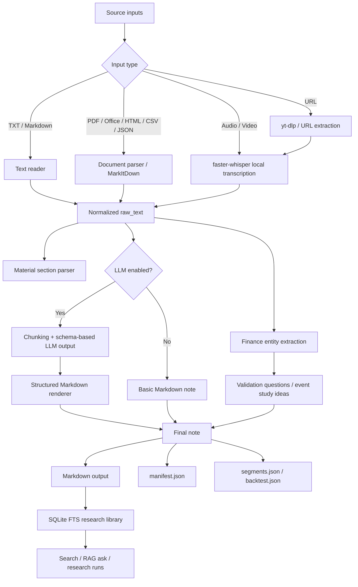

# infra-ingest Architecture

`infra-ingest` is a local-first AI research infrastructure project. Its goal is to turn unstructured research materials into traceable, searchable, and reviewable Markdown research assets.

The system is designed around a simple principle: LLM output is useful only when the surrounding pipeline preserves source context, processing state, and reproducibility.

## System Goal

Research teams often work with PDFs, websites, audio recordings, videos, meeting notes, and local documents. These inputs are valuable, but they are difficult to reuse when they remain scattered across formats and folders.

`infra-ingest` provides a local pipeline that:

- normalizes many source types into `raw_text`;
- optionally structures that text with an OpenAI-compatible LLM;
- extracts finance-oriented entities and validation questions;
- writes Markdown notes and sidecar metadata;
- indexes notes into a local SQLite research library;
- supports search, RAG-style Q&A, and research run auditing.

## Data Flow



## Subsystems

### Input Adapters

The CLI accepts local files and URLs. Supported local formats include text, Markdown, common Office files, PDFs, HTML, CSV/JSON/XML, and audio/video formats.

For URLs, the system uses `yt-dlp` where possible and then routes media through the same local transcription path as local audio/video files.

### Extraction and Normalization

All source types are normalized into a single `raw_text` representation. This keeps downstream logic independent from the original file format.

- text and Markdown are read directly;
- documents are converted to Markdown-like text;
- audio/video are transcribed with `faster-whisper`;
- transcription segments retain timestamps for later traceability.

### LLM Layer

The LLM layer is optional. If no API key is configured, or if the user passes `--no-llm`, the system still generates a basic Markdown note.

When enabled, the LLM is treated as a structured transformation layer rather than a free-form writer:

- long inputs are chunked before final synthesis;
- prompts request a JSON object with a known schema;
- local code parses the JSON and renders Markdown;
- evidence snippets are preserved in the generated note.

This reduces formatting drift and makes the output easier to test.

### Finance Research Layer

The finance layer extracts research-oriented entities from raw and structured content:

- companies;
- tickers;
- industries;
- metrics;
- factors;
- risk events.

It also generates data-verifiable questions, such as whether a metric improvement leads future returns or valuation recovery. If local price data and an event date are provided, the system can write a small event-study sidecar.

### Storage and Indexing

The canonical user-facing output is Markdown. Sidecar files preserve machine-readable state:

- `.manifest.json`: input path, hash, models, prompt version, output paths, timestamps;
- `.segments.json`: transcription segments with timestamps;
- `.backtest.json`: event-study result when available;
- `.infra_ingest/library.sqlite`: local SQLite FTS index;
- `.infra_ingest/graph.json`: lightweight entity graph.

SQLite FTS is used before a vector database because it is local, inspectable, dependency-light, and sufficient for exact keyword and metadata-filtered search. This keeps the first version easy to run and easy to debug.

## Key Engineering Choices

### Local-first by default

Sensitive research material should not be sent to a remote service by accident. The system can run in `--no-llm` mode and uses local Whisper for transcription.

Remote LLM calls are opt-in through environment variables and command-line behavior.

### Markdown as the durable interface

Markdown is easy to inspect, version, search, and move into tools like Obsidian. This makes the output useful even if the codebase changes later.

### Manifest for observability

Every run writes a manifest. The manifest records what was processed, which model settings were used, where the outputs landed, and which sidecar files were generated.

This is the minimum useful observability layer for a research ingestion pipeline.

### SHA256 for input identity

File names are unstable. Hashing the input helps identify whether two notes came from the same source content and supports future deduplication or caching.

### JSON schema before Markdown rendering

LLMs are better at producing useful content than stable formatting. Asking for structured JSON and rendering Markdown locally keeps the output more predictable.

### Sidecars instead of hidden state

Segments, manifests, and event-study results are written as separate files so that debugging does not require digging through a database.

## Reliability Boundaries

What the project currently handles well:

- multi-format ingestion;
- local transcription;
- no-LLM fallback;
- structured LLM notes;
- local search and metadata filtering;
- simple RAG-style answers over retrieved snippets;
- research run records;
- CI-backed Python tests.

What it is not yet:

- a full multi-user research platform;
- a production-grade queue system;
- a permissioned enterprise document store;
- a complete vector retrieval platform;
- a validated investment decision engine.

## Privacy Boundary

`--no-llm` mode does not send extracted text to a remote model. It still writes local Markdown, manifest, and index state.

If LLM mode is enabled, extracted text is sent to the configured OpenAI-compatible API. For private materials, prefer:

```bash
./run ingest -i private.pdf --no-llm
```

or a local OpenAI-compatible model server:

```bash
./run ingest -i private.pdf --env .env.local
```

Do not upload `.infra_ingest/`, `outputs/`, raw archives, or private source files to a public repository.

## Extension Roadmap

- MCP server for direct agent integration.
- HTTP API for a web UI or internal team service.
- Batch ingestion with job queue and retry state.
- Optional vector database backend for semantic retrieval.
- Richer evaluation suite for prompts and extraction accuracy.
- Team-level access control and audit logs.
