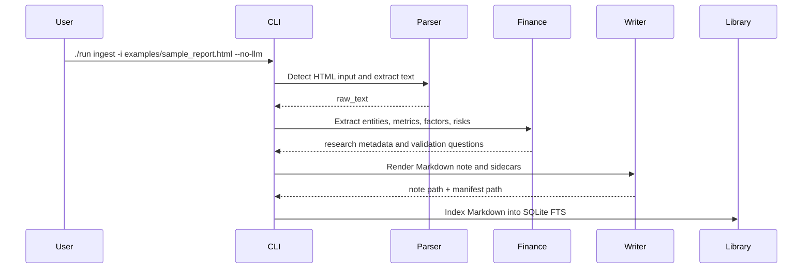

# Case Study: Research Material Ingestion for an AI Infra Workflow

This case study uses a public synthetic sample, not a private research report. It demonstrates how `infra-ingest` turns scattered research materials into traceable notes and searchable local state.

## Scenario

A research intern receives mixed materials about an industry topic: a short HTML report, meeting notes, or an audio recording. The task is not only to summarize the source, but to preserve where the conclusions came from and make the material reusable later.

The workflow should answer:

- What is the source about?
- Which entities, metrics, risks, and research questions appear?
- Where is the processed note stored?
- Can the result be searched or audited later?
- Can the pipeline run without exposing sensitive material to a remote LLM?

## Input

The demo source is:

```text
examples/sample_report.html
```

It is a small synthetic HTML sample about AI infrastructure for research material ingestion. It includes observations about local transcription, document parsing, Markdown output, and workflow design.

## Command

Run the demo in no-LLM mode:

```bash
./run ingest -i examples/sample_report.html -o ./outputs --title "AI Infra 投研接入样例" --material-type research_report --no-llm
```

This mode does not require an API key and does not send extracted text to a remote model.

## Pipeline Steps



## Outputs

The run writes a Markdown note and sidecar metadata:

- `AI Infra 投研接入样例.md`
- `AI Infra 投研接入样例.manifest.json`
- optional graph and research run records in `.infra_ingest/`

The Markdown note includes:

- YAML metadata;
- source information;
- extracted text;
- finance-oriented research section;
- validation questions when metrics or entities are found.

The manifest records:

- original input reference;
- resolved local input path;
- input sha256;
- output note path;
- model settings when LLM mode is used;
- prompt version and material type;
- sidecar output paths.

## Why This Matters for AI Infra

This is an infrastructure workflow rather than a one-off prompt because the value comes from the surrounding system:

- Ingestion normalizes heterogeneous inputs into one text interface.
- Local processing allows private materials to stay local in no-LLM mode.
- Structured outputs keep notes readable and versionable.
- Manifests make each run auditable.
- SQLite FTS turns one-off notes into a searchable local library.
- Sidecar files expose intermediate state for debugging and future integration.

## Business Value

For a research team, this reduces the manual work needed to transform raw materials into reusable research assets.

Before:

- manually open PDFs, web pages, and audio recordings;
- copy conclusions into separate notes;
- lose the processing context;
- search across folders by file name;
- repeat the same cleaning and extraction steps.

After:

- run one command per source;
- produce a Markdown note with metadata;
- retain input hash and processing manifest;
- index outputs into a local research library;
- search and ask questions over accumulated notes.

## Interview Talking Points

This case study supports several AI Infra interview topics:

- how to design an ingestion pipeline across multiple file types;
- why observability matters for LLM workflows;
- how to keep private materials local;
- how to make generated notes reproducible and searchable;
- why an LLM layer should be optional and schema-constrained;
- how to extend the system into MCP, API service, batch jobs, or vector retrieval.

## Limitations

This demo is intentionally small and synthetic. It is not investment advice, and it does not validate whether any investment thesis is correct.

The current event-study module is only an initial validation tool. A full quant research workflow would require broader datasets, stricter sample construction, factor neutralization, transaction cost assumptions, and out-of-sample evaluation.
